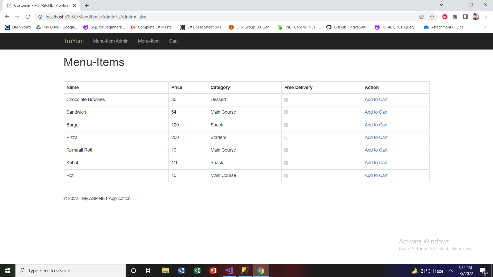
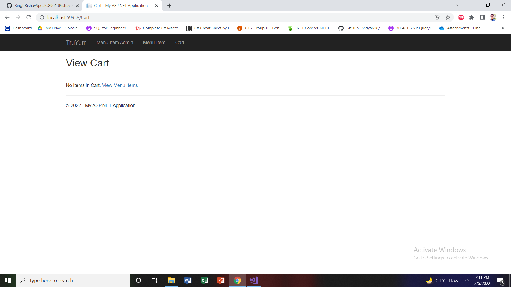
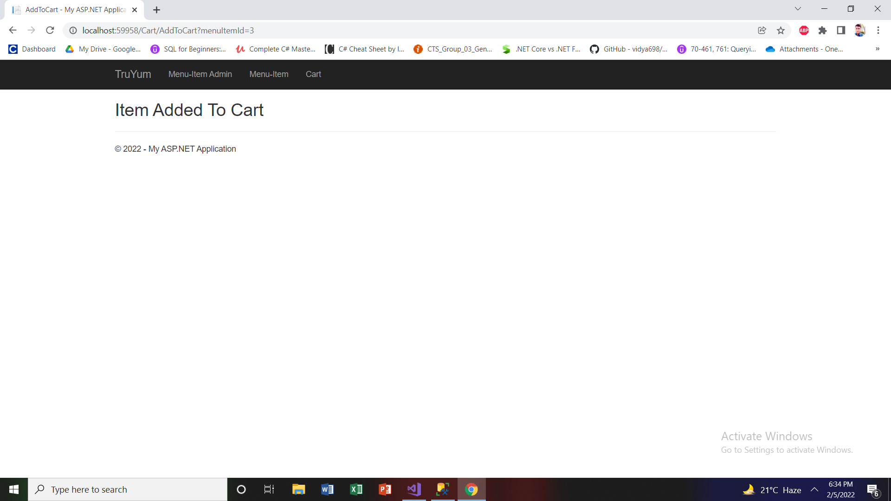

# Truyum
Food delivery web application made using ASP.Net.

<h3>Admin Page</h3>

<h3>Only Admin has all the power to create and edit the food items according to the availability of the item</h3>

<h3>Customer Page</h3>

<h3>Initially the cart is empty</h3>

<h3>Once a customer chooses add to cart, the item is added to cart</h3>

<h3>Finally the customer has something to order and eat by placing order</h3>

